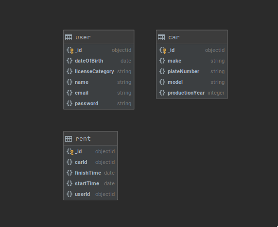
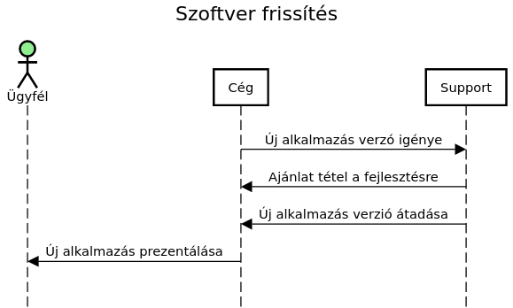

# Projektterv

Rendszerünk célja roppant egyszerű. Autókölcsönző cégünknek hozunk létre egy
online alkalmazást, így a vásárlóink számára megkönnyítjük magát a kölcsönzést.
Továbbá alkalmazottaink számára is egyszerűbbek és elérhetőbbek lesznek a
szolgáltatások.

Fontos megjegyezni, hogy rendszerünkben különbséget teszünk vendég/felhasználó
illetve admin között. Azokat a felhasználókat akik még nem regisztráltak, vendégnek
hívjuk, így ők csak általános információkat láthatnak egyes gépjárművekről.

Ha a vásárló szeretné jobban átlátni egyes gépjármű állapotát/adatát, szükséges
regisztrálnia ami egy külön felületen lesz elérhető.

Külön szolgáltatást nyújtunk saját alkalmazottainknak is (admin), akik az online
rendszerben tudják ezentúl kezelni a kölcsönzéseket, nyilvántartásokat illetve
karbantartást. Ez a felület viszont a mindenképpen a "design" elé helyezi a
funkcionalitást.

# Üzleti folyamatok modellje

# Követelmények

# Funkcionális terv

# Fizikai környezet

## Platform
* React
* Express
* MongoDB

## Hardver

**Szerver hardver igény:**
A szerver NodeJS 12.x vagy nagyobb elérhető

**Felhasználásói hardver igény:**
Az alkalmazás platform független webalkalmazás.
Olyan hardver szükséges ami a modern böngészöket képes futtatni.
Támogatott platformok: 
- Windows
- Linux
- MacOS
- Android
- iOS

## Halózat, tűzfal

Külön hálózati beállításokat nem igényel az alkalmazás. 
A böngésző kezel mindent.

## Fejlesztő eszközök

* Visual Code - kódírás, szövegszerkesztés
* Atom - kódírás, szövegszerkesztés
* Prettier - formázó eszköz
* VS Plugins:
  * ES7
  * ES6
  * HTML Snippets

## Keretrendszer

Alkalmazásunk az alábbi keretrendszereket használja:
* React(Frontend)
* Express(Backend)

# Absztrakt domain modell

# Architekturális terv

# Implementációs terv

# Adatbázis terv

## Bevezetés

Az alkalmazás adatainak tárolására a [MongoDB](https://www.mongodb.com/) nevű adatbázist fogjuk használni.
A MongoDB egy flexibilis, jó skálázhatósággal rendelkező NoSQL  adatbázis. 
Az adatokat JSON-höz hasonló dokumentumokban tárolja, az adatok 
struktúrája
szempontjából nagyobb rugalmasságot biztosít, mint egy SQL adatbázis, 
ugyanis nincs szükség előre definiálni a táblákat, ezek közötti kapcsolatokat. 

## Kollekciók 

Az adatbázis három kollekciót fog tartalmazni, amik a következőek: 
+ user - a felhasználók adatai 
+ car - a bérelhető autók adatai 
+ rent - a bérlések adatai 

## Sémák 

Az adatbázis kódban való kezelésére a [mongoose](https://mongoosejs.com/) NodeJS könyvtárat fogjuk használni. 
Ezzel lehetőség nyílik arra, hogy a kollekciókhoz sémákat rendeljünk hozzá, ami nagyban megkönnyíti az adatbázisba való beillesztést. 

**User Séma**

    const UserSchema = new mongoose.Schema({
	    name: {
		    type: String, 
		   required: true
	    },
	    email: {
		    type: String,
		    required: true
	    },
	    password: {
		    type: String,
		    required: true
	    },
	    dateOfBirth: {
		    type: Date,
		    required: true
	    },
	    licenseCategory: {
		    type: String,
		    required: true
	    },
        createdAt: {
            type: Date, 
            default: Date.now()
        },
        updatedAt: {
            type: Date,
            required: false
        },
        deletedAt: {
            type: Date,
            required: false
        }
    });

**Car Séma**

    const CarSchema = new mongoose.Schema({
	    plateNumber: {
		    type: String,
		    required: true
	    },
	    make: {
		    type: String,
		    required: true
	    },
	    model: {
	    	type: String,
		    required: true
	    },
	    productionYear: {
		    type: Date,
		    required: true
	    },
        createdAt: {
            type: Date, 
            default: Date.now()
        },
        updatedAt: {
            type: Date,
            required: false
        },
        deletedAt: {
            type: Date,
            required: false
        }
    });

**Rent Séma**

    const RentSchema = new mongoose.Schema({
	    carId: {
		    type: mongoose.ObjectId, 
		    required: true
	    },
	    userId: {
	    	type: mongoose.ObjectId,
		    required: true
	    },
	    startTime: {
	      	type: Date,
		    required: true
	    },
	    finishTime: {
	    	type: Date,
		    required: true
	    }
    });

**Vizualizáció:**

# Telepítési terv

# Tesztterv

# Karbantartási terv

## Karbantartás

Hetente az aktuális bugok és hibák javítása, patchelés.
Amennyiben a fatális hiba, ami a program működését megakadályozza, akkor azonnali
elhárítás. Ha a hiba nem akadályozza a program működését, akkor az adott heti
karbantartás alkalmával orvosoljuk a hibákat.

## Szoftver frissítés folyamata

Az aktuális verzió működésben tartása, amennyiben lehetséges, 
addig amíg az új verzió elkászül. Az új verzió telepítése egy kevésbé frekventált
időszakban.
Amennyiben az aktuális verzió nem tartható működésben, akkor gyors, sprintben 
való fejlesztés.

## Modellek

# A rendszer célja
